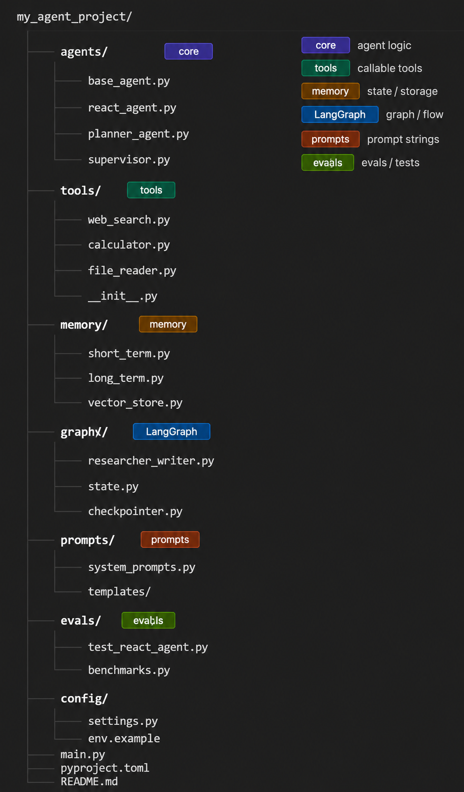

# My Agent Project

A structured Python framework for building agentic AI workflows — from a simple ReAct agent to enterprise-grade multi-agent systems.

---

## Directory Structure



---

## Folder Breakdown

| Folder | Purpose |
|---|---|
| `agents/` | Agent logic — base loop + specialized agents |
| `tools/` | One file per callable tool |
| `memory/` | Short-term (context), long-term (JSON/DB), vector store |
| `graphs/` | LangGraph graphs, state definitions, checkpointers |
| `prompts/` | All prompt strings, never hardcoded in agent files |
| `evals/` | Benchmarks and test queries |
| `config/` | Env var loading, `.env.example` |

---

## Stack

- **Python** 3.11
- **LangChain** + **LangGraph** — agent orchestration
- **HuggingFace Inference API** — LLM backend (free tier)
- **Tavily** — agentic web search
- **uv** — package management

---

## Setup

```bash
# Install dependencies
uv pip install langchain langgraph huggingface_hub tavily-python

# Set environment variables
cp config/.env.example .env
# Fill in HUGGINGFACE_API_TOKEN and TAVILY_API_KEY

# Run
python main.py
```

---

## Agents Built

- [ ] ReAct agent (plain Python + HuggingFace)
- [ ] Plan-and-Execute agent
- [ ] LangGraph researcher + writer (2-node)
- [ ] LangGraph system with supervisor + HITL
- [ ] CrewAI 4-agent crew
- [ ] AutoGen GroupChat

---

## 8-Week Checkpoints

### Week 1 — Agent Fundamentals + Multi-Agent Orchestration
- [ ] ~~ReAct agent with 3 tools (`web_search`, `calculator`, `get_current_time`)~~
- [ ] LangGraph 3-node system with conditional routing
- [ ] Same task implemented in LangGraph, CrewAI, AutoGen
- [ ] Framework comparison doc (`docs/framework_decision.md`)

### Week 2 — MCP + A2A Protocols + Agent State
- [ ] 2 MCP servers connected (file tools + mock financial API)
- [ ] 2 A2A agents communicating via full task round-trip
- [ ] Mem0 + Redis + SQLite checkpointing all working
- [ ] Conflict resolver node (2 agents disagree → judge agent decides)

### Week 3 — Guardrails + Safety Architecture + Start Project 1
- [ ] PII masking + hallucination detection guardrails
- [ ] E2B sandbox for isolated code execution
- [ ] `ToolRegistry` with 3 permission tiers (read / write / destructive)
- [ ] Append-only audit logger in MongoDB
- [ ] Project 1 repo live with supervisor + 4 stub agents

### Week 4 — Build Project 1 (Complete) + Evaluation Foundations
- [ ] Project 1 (FinCrime Supervisor) complete on GitHub
- [ ] 10-alert end-to-end test suite passing
- [ ] LangSmith dashboard live with cost + risk tags per span
- [ ] 20-case gold-standard evaluation suite (JSON in → JSON out)
- [ ] Project 2 (AgentBench) repo initialized

### Week 5 — Build Project 2 (Complete) + Observability
- [ ] Project 2 (AgentBench) complete on GitHub + published to PyPI
- [ ] GitHub Actions CI on Project 1 (scorecard posted as PR comment)
- [ ] GAIA Level 1 benchmark results published in README
- [ ] Phoenix + Weave + LangSmith all ingesting traces

### Week 6 — AWS Production Deployment + Start Project 3
- [ ] Project 1 deployed on AWS (Lambda + SQS + Bedrock Knowledge Base)
- [ ] Locust load test report (P95 latency, cost per session, error rate)
- [ ] Project 3 server running: registry + capability search + E2B + router
- [ ] Mixture-of-Agents + self-refine loop + Mem0 integrated into Project 3

### Week 7 — Finish Project 3 + Frontier Topics
- [ ] All 3 projects on GitHub with READMEs + architecture diagrams + demos
- [ ] GitHub Actions CI passing on Project 1
- [ ] AgentBench GAIA results current in Project 2 README
- [ ] LinkedIn post draft ready

### Week 8 — Deep Review + Portfolio Polish + Publish
- [ ] 3 production-grade projects on GitHub, all test suites passing
- [ ] All 3 repos: working setup in under 10 commands from a fresh clone
- [ ] LinkedIn post live
- [ ] Portfolio complete

---

## Project Milestones

| Project | Starts | Finishes |
|---|---|---|
| Project 1 — FinCrime Supervisor | Week 3 Saturday | Week 4 Friday |
| Project 2 — AgentBench | Week 4 Sunday | Week 5 Sunday |
| Project 3 — OpenAgentMesh | Week 6 Thursday | Week 7 Wednesday |

---

## Notes

- All prompts live in `prompts/` — never hardcoded inside agent files
- Each tool is a standalone file in `tools/` exporting a single callable
- `graphs/state.py` holds the shared `TypedDict` flowing through all LangGraph graphs
- Eval scripts in `evals/` benchmark latency, token cost, and lines of code across frameworks
